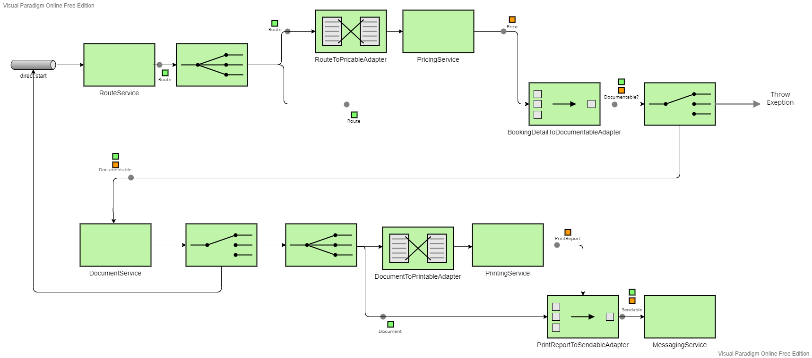

# TicketAutomaton (EAI)
A ticket automaton that is part of the component oriented software architecture course at our university. The automaton consists of
multiple components. These components are integrated with the Enterpise Integration Patterns (EIP), which are realized with ApacheCamel Routes.

## Authors
- [@Tonnanto](https://www.github.com/Tonnanto)
- [@Plploe](https://github.com/Plploe)

---
## Development Process

1. The detail of requirements for this system was very limited.
2. Neither did we have prior knowledge of this domain nor did we have contact to someone who does.

This led to many of our architectural decisions result in a compromise between the given requirements and our personal understanding of a useful system that makes sense in this domain.

___
## Architecture
This automaton consists of multiple components. The **assembly-line** acts as the entry point for the "Buy Ticket" use case and defines the camel routes to integrate the 5 domain components.
The `structure` package of each domain component contains domain specific types and their relations.
The `behaviour` package of each domain component contains a service interface and a default implementation of such.
The service interface has methods that represent the use cases of this module.
The service implementations also manage user interaction (utilizes the **ui-system** component to display an appropriate view).

### EIP Integration:

